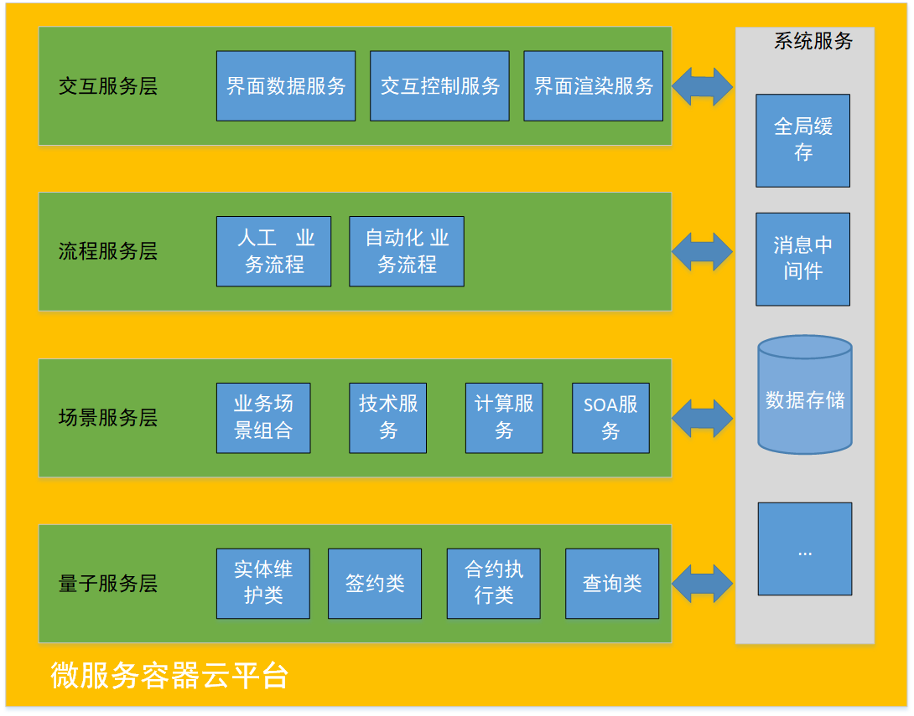
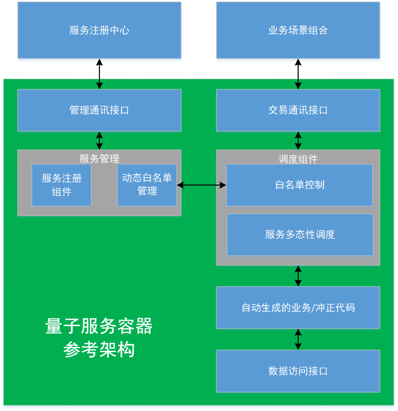
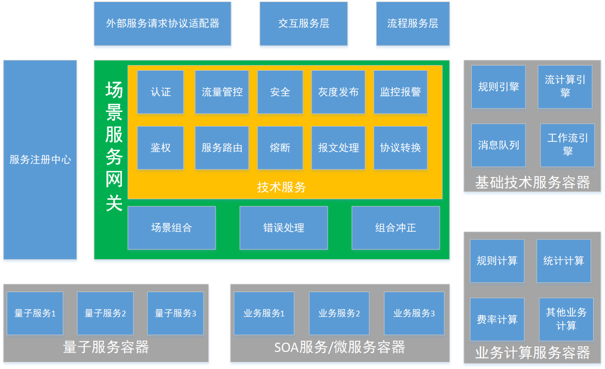
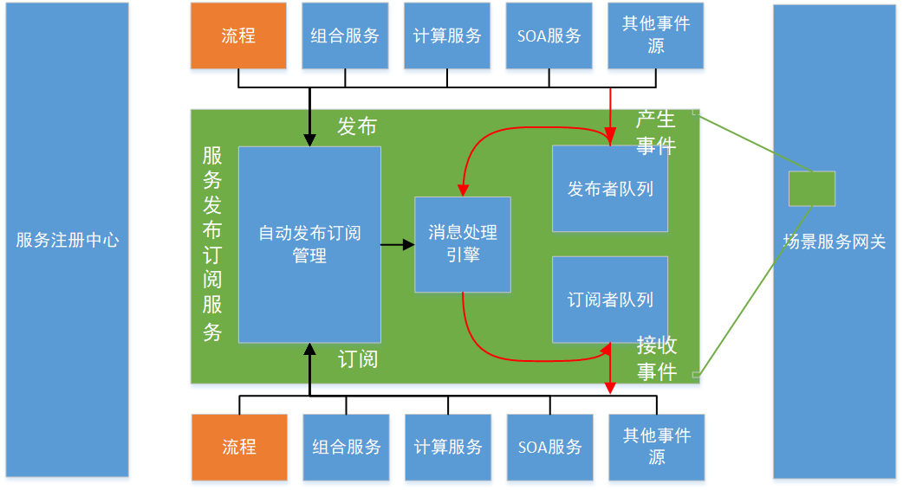
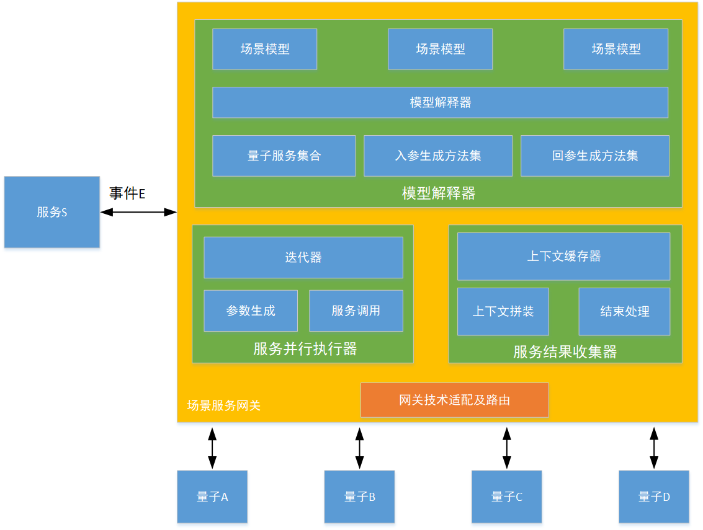
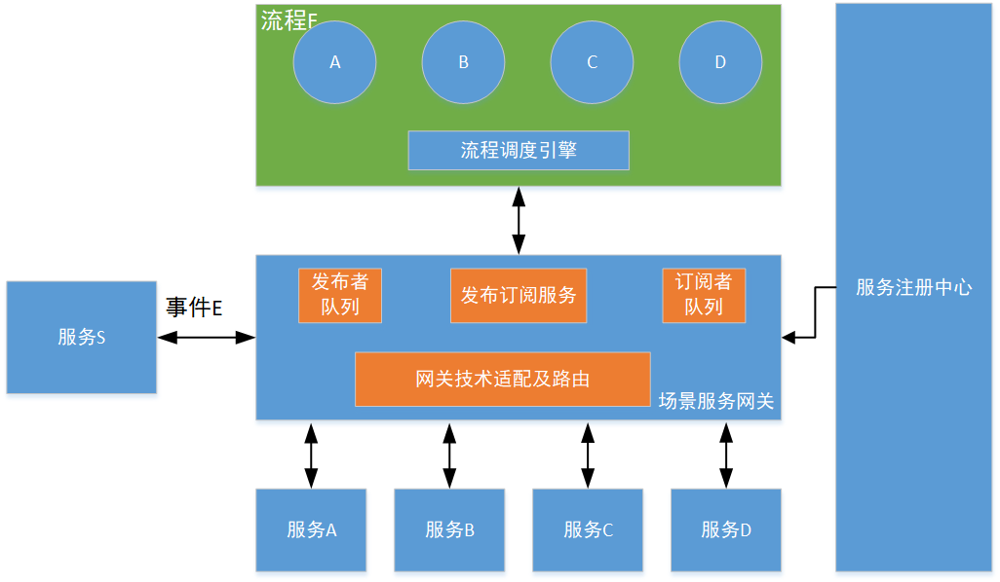
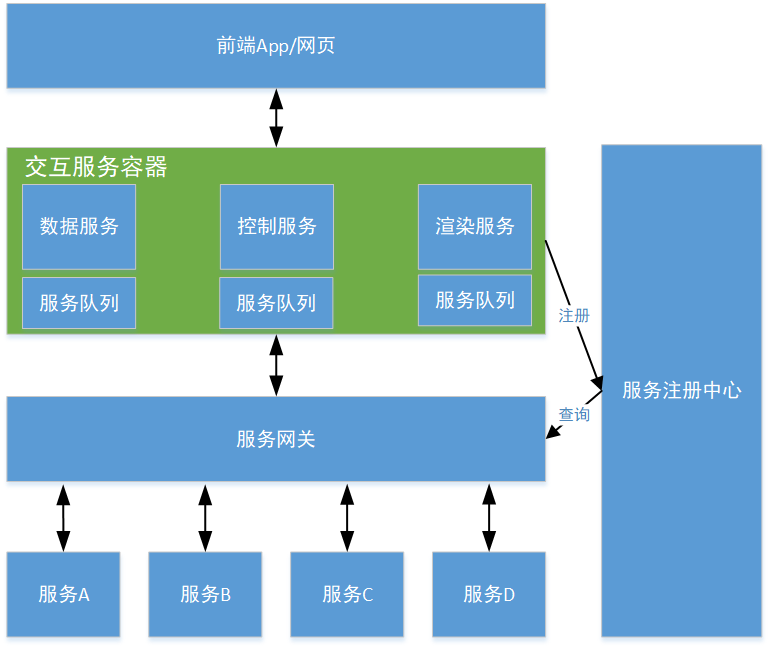

# S++参考逻辑架构

S++分层的基本原则大体和服务的颗粒度相关，颗粒度越小的越靠近底层，越是底层对服务的自动化程度要求越高，对服务的性能和可靠性要求也越高。

逻辑上建议分为四层，以对应不同颗粒度的服务。

* 量子服务层对应最小颗粒度的服务，相当于传统的微服务
* 场景服务层对应最小颗粒度的组合，相当于传统微服务架构下的服务编排，同时对应传统SOA架构下的业务服务。
* 流程服务层对应人工业务流程，相当于传统BPM。
* 交互服务层用于处理人机交互界面的逻辑，相当于传统的WEB应用。

整个S++建议通过微服务容器云进行部署，可以方便的使用微服务架构现有的工具，以及容器云的快速部署和动态伸缩能力。

## 量子服务层

量子服务层对应微服务架构的微服务层，量子服务层颗粒度最小，可以小到仅操纵参与者的单一属性。量子服务层的服务对外只会访问数据层，不会再访问其他服务，因此可以采用非常简洁的框架实现。量子服务层的框架内仅需包含如下基本内容：

* 数据访问工具（包括数据库和数据文件等）
* 同步/异步服务端通讯组件。为了保证更高的吞吐量，S++推荐量子服务对外采用异步的通讯方式。
* 必需的管理服务（服务注册工具，IP白名单管理）
* 基于动态IP白名单的安全组件
* 根据业务模型自动生成的服务代码（包括冲正代码）
* 服务多态性实现

量子服务框架越简单，对系统整体的动态伸缩性越友好。当量子服务容器的启动和停止的时间缩短到几十毫秒这个量级的时候，业务服务对负载突发性变化的响应能力就基本上与集群下预置冗余节点的响应能力相接近。所以，从动态伸缩这个角度看，服务的颗粒度的确是越小越好。

## 场景服务层

服务场景层对应传统的SOA服务层，业务场景组合如果用SOA的方式实现的话，就是传统的高内聚松耦合的SOA服务。场景服务层的运行框架，应满足如下要求：

* 异步的服务发布订阅机制。由于SOA的服务通常体积庞大，响应时间比较长，所以为防止系统拥塞造成的影响，建议采用异步通讯方式。
* 为方便随时可以更改技术手段，需要框架提供可插拔的技术适配流程。
* 需要框架满足技术与业务分离的要求。
* 需要实现并行组合交易引擎
* 需要提供必要的适配技术服务

场景服务网关可以利用现有的微服务网关进行改造，主要增加场景组合服务引擎、错误处理拦截器以及组合冲正等模块。在S++架构中，由于在量子服务层实现了服务间的零耦合，所以在整体架构中都推荐服务间零耦合，也就是说任意两个服务（无论是量子服务、SOA服务还是计算服务）之间都不建议相互直接调用，所有的调用都要通过流程来完成。

### S++服务调用参考模型：

* 流程：包括人机界面流程、人工流程和自动化流程。
* 发布：所有服务（除量子服务外）和流程都可以发布，服务发布者会将服务本身的运算结果发送到平台指定的队列中，流程发布者会将下一个运算节点的数据和上下文发布到指定队列。
* 订阅：所有服务（除量子服务外）和流程都可以订阅，但是只有流程可以订阅服务，服务不能直接订阅服务（只能订阅流程）。
* 其他事件源：其他事件源只能作为服务参与，一般是定时事件和外部事件。
* 队列消息持久化：推荐只将人工流程所对应的发布队列持久化，因为人机界面流程和自动化流程都是有时效性的。
* 服务幂等性：所有被调用的服务必须可以幂等调用，以保证流程意外中断后可以再次被执行。
* 业务服务可冲正：业务服务包括组合服务与SOA服务，必须提供相应的冲正能力。
* 自动发布订阅管理：S++推荐由系统通过分析流程所引用的服务，自动识别发布订阅规则，这样可以免去人工操作带来的大量问题。

### 场景组合引擎

S++场景组合引擎用于执行基于量子服务的组合服务，执行过程是完全并行的，当场景中所有的量子服务调用都返回后，引擎会将所有的返回结果拼装成服务执行契约，持久化并将契约返回给调用者（或产生新的事件）。下图给出了解释执行的异步量子服务组合的参考实现架构：

## 流程服务层

流程服务层主要提供BPM服务和自动流程服务。

* 通过技术与业务分离，BPM可以只面向业务服务的内涵进行流程编排。
* 通过服务多态性，BPM可以消除业务分支。
* S++推荐使用纯异步的流程调度方式。

下面举例说明一下纯异步工作流调度与整个系统的交互过程，一个工作流F内部包含ABCD四个服务节点，如下图：

上图中假设发布订阅服务在网关中以技术服务的形式实现，发布者队列为内存队列，订阅者队列由订阅者在服务注册中心注册的队列地址决定。流程的发起是由某服务S产生了一个事件E开始的。

1. 服务S调用网关产生事件E，报文E经过技术适配处理后成为只保留业务内涵的对象SDO（Service Data Object），SDO进入发布者队列。
2. 发布订阅服务监听到SDO，查找服务内订阅表找到所有关注服务S的流程列表，返回流程F
3. 发布订阅服务调用网关路由器，用SDO访问流程F。
4. 路由器根据注册中心注册的流程F的地址，获得订阅者队列的协议。
5. 路由器调用服务技术适配将SDO转换成流程F所需的报文格式，并添加必需的技术报文，调用队列协议将报文T发送到订阅者队列。
6. 流程F收到访问报文T，获取和T相关的流程上下文（基于流程引擎的实现，上下文有可能缓存在不同的存储中，也有可能随报文传送）。由于本次调用为流程的初始调用，所以上下文不存在，流程引擎判断为初始调用，修改并缓存新的上下文。
7. 流程F调用服务网关，产生新的事件Ea。
8. Ea重复1~5步过程，只不过订阅表中订阅Ea的服务和流程只有服务A，所以网关会将报文发送到服务A的订阅者队列中。
9. 服务A收到报文进行处理，处理完后调用网关产生事件Eb。Eb重复1~5步骤，将报文再次发送给流程F。
10. 流程F重复第6步动作，但这次上下文不为空，恢复上下文后得知下一步需要调用服务B。于是同样处理后，向网关发起调用，流程周而复始直到服务D调用完成。
11. 流程F完成所有节点调用，要结束流程，调用网关产生事件Eclose。
12. 事件Eclose订阅者为服务S，于是服务S收到流程结束报文，整个调用过程结束。

## 交互服务层

交互服务层主要为前端人机交互界面提供数据、渲染和控制逻辑，对应传统的WEB应用。

页面交互的服务调用流程如下：

1. 前端调用交互容器中的渲染服务，返回页面。
2. 前端调用数据服务，数据服务调用服务网关。
3. SOA查询服务或组合查询服务收到查询事件请求，执行查询任务，调用网关生成查询结果事件。
4. 数据服务订阅到查询结果，返回前端页面。