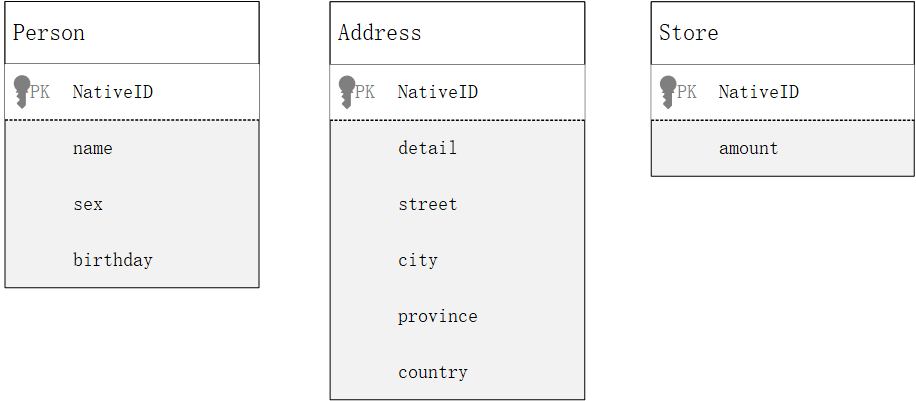
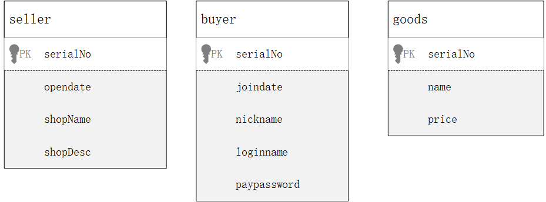
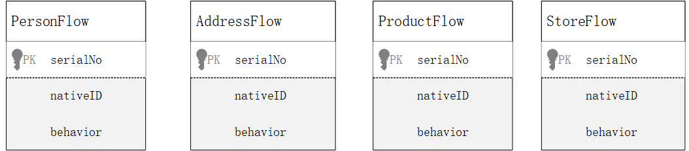
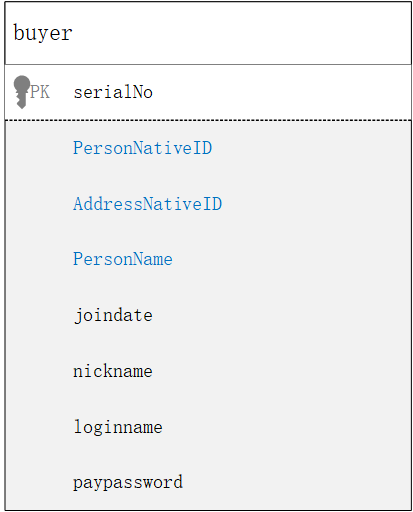

# S++分析和建模初步：一个简化的例子

采用领域建模的方法可以方便的进行S++业务建模，在宏观层面这两者是基本一致的，不过在微观层面需要注意转换成S++的分析和建模方式。我们用一个典型的业务场景来模拟真实的业务建模过程。

## 订购场景的建模

我们假定一个单一商品订购的场景，在这个场景中，最基本的包含三个参与者：卖家、买家和商品。于是我们获得一个业务服务模型：


下面来定义等式右边的三个参与者和一个行为，首先来定义行为：

```java
behavior order{
    key string orderID;
	int quantity;
    datetime orderdate;
    string shippingAddress;
    string contactName;
    string contactTelephone;
}
```

订单行为中，定义了除可能参与者信息在内的所有必要信息。

接下来定义卖家和买家，买家和卖家只是一种身份标识，所以需要通过签约才能产生身份契约：


```
identify behavior openShop{
	datetime opendate;
	string shopName;
	string shopDesc;
}

service OpenShop 
	from Person, Address 
	by openShop
	identify contract seller;
	
identify behavior joinMember{
	datetime joindate;
	string nickname;
	string loginname;
	string paypassword;
}

service JoinMember 
	from Person, Address 
	by joinMember
	identify contract buyer;

//定义实体
Object Person{
	string name;
	int sex;
	date birthday;
}

Object Address{
	string detail;
	string street;
	string city;
	string province;
	string country;
}
```

定义商品：


```
behavior registerGoods{
	double price;
	string name;
}

service RegisterGoods
	from seller, Product, Store
	by registerGoods
	identify contract goods{
		limit: Store.amount >= 0
			&& Store.amount < 10000;
	};
	
Object Product{
	string productName;
	double weight;
	double length;
	double height;
	double width;
	date produceDate;
}

Object Store{
	int amount;
}
```

定义场景和量子服务：

```
service OrderGoods
	from seller, buyer, goods
	by order
	executable contract Invoice{//列出所有要记录到订单中的字段
		string InvoiceStatus = "open";
	};
	
behavior cancel{
	key string orderID;
	int amount;
	datetime cancelDate;
	string reason;
}

service CancelOrder
	from seller, buyer, goods
	by cancle
	executable contract Invoice{
		InvoiceStatus = "close";
	};
    
quantum goods*order{
	Store.amount.decrease(order.quantity);
}

quantum goods*cancel{
	Store.amount.increase(cancel.quantity);
}
	
```

定义查询场景：

```
behavior query{
	Namepare[] conditions;
}
service Invoice
	from Invoice, seller, buyer, goods
	by query
	dynamic contract InvoiceInfo{
		//needed Seller info list
		
		//needed Buyer info list
		
		//needed goods info list
		
		//needed Invoice info list
	};
	
```

## 订购场景的技术实现

上述的建模过程中没有涉及任何关于这个场景的技术实现，S++中由于业务和技术的彻底分离，这两者可以完全独立的进行设计。这里讨论一种最自然的实现方式，也就是说这种实现会最为贴近真实的世界。

S++的自然实现遵从几个基本原则，这些原则也同样约束着建模过程：

* 系统必然由自然实体组成
* 所有的业务一定会产生契约
* 有两种重要的契约：第一种约定身份（角色），称之为身份契约；第二种约定业务活动，称之为可执行契约。
* 自然实体必须获得身份，才可以参与订立可执行契约。
* 契约不可更改，只能重新订立。对同一个契约，新的约定会替代老的约定。
* 契约既可以有预定义的格式，也可以根据业务场景产生临时格式的契约。
* 忘掉面向对象的方法，忘掉数据表之间会有关系。

虽然S++并不适合构建在关系型数据库上，不过为了便于理解，依然使用部分关系型数据库的概念来描述技术实现。

**自然实体表**

根据上述原则，首先会有三张实体表：Person, Address和Store。自然实体必然有唯一的个体识别方式（比如指纹、DNA），从技术实现上为简化处理系统为每个自然实体提供了一个唯一标识NativeID。这个NativeID纯粹是为了技术实现方便，因此不会出现在业务建模过程中，业务人员也完全不知道有这个属性存在。



​																			自然实体表

**身份契约表与实体流水表**

由于所有业务中的参与者都是以某种角色参与业务活动的，所以每个自然实体在参与业务活动之前必然会有至少一次的身份签约活动，在产生契约的同时会有对应契约表产生seller，buyer，goods。由于上面的例子中为了便于理解，签约过程都采用的是临时格式的契约，所以身份契约表的内容与签约场景的内容完全一致。



​																			身份契约表

比如seller的身份契约表中记录了签约行为包含的内容，其他的身份契约表也类似。但是，与自然实体表不同的是，契约表本身是没有NativeID的，这是因为契约不是自然实体，相应的为了技术上方便为每张契约分配了一个流水号SerialNo。奇怪的是，这张契约中为什么没有参与者信息，没有参与者信息如何关联到是谁签署的契约呢？对的，有个原则是忘掉面向对象和关系型数据。现实生活中，任何契约都不仅仅只有一份，系统（见证人）要保留一份，每个签约人也都会保留一份（有可能是个存根，或者一式两份）。

所以每个实体都会有一张实体流水表来保存签约的存根，这个流水表中会保存签约的契约流水号SerialNo用来记录参与的是哪张契约，还有NativeID说明是哪个实体参与的，以及场景名称来标记签约的目的。



以上是契约的最简形式，我们假定系统是公正严明的、没有漏洞的，签约者是诚实可信的，那么大家把自己的契约存根拿出来拼接一下，就能还原完整的契约了。但实际上我们并不需要如此的节约空间，适当的冗余可以省去很多麻烦。所以，通常可以在身份契约表中保留部分的参与者要素信息，比如NativeID等。这些冗余信息不仅带来了查询的便利，同时也降低了对系统安全性的要求，比如为防止伪造身份，可以通过比对身份契约中的NativeID来达成。增加冗余的契约定义如下：

```
//Adding redundant information to the contract
service JoinMember 
	from Person, Address 
	by joinMember
	identify contract buyer{
		Person;//records the NativeID of Person
		Address;
		Person.name;
	};
```

这样契约表的结构就增加了蓝色的冗余部分。



换个角度看，没有冗余信息的契约类似于不记名卡，而增加了冗余的契约就是记名卡。再一次强调，S++的存储结构是不依赖于对象之间的关系的，由于S++以行为为主体，所以在技术实现上，存储之间的唯一可靠关系就是业务活动的序列号。

**可执行契约与实体变化**

仿照前面的身份契约表，类似的可以建立一张可执行契约表invoice，结构完全一样，系统赋予每条记录一个唯一的流水号。同样的，每一个参与者都会有一张流水表。

* 可执行契约的状态变化

  与面向对象不同，S++中契约并不是自然实体，所以契约并不存在属性的改变。比如库房是自然实体，库房中商品库存量的降低就属于自然实体的改变，而订单中采购量的变化并不一定能真实的反应库存的变化。既然如此，参照现实通常都是重新签署一份契约来废弃上一份契约。于是在本例中，取消订单是需要采购契约中所有的参与者重新签署一份取消的契约，约定取消或部分取消上一份以orderID为标识的契约。可执行契约的状态以时间线上的最后一个的契约为准。

  **注意**：可执行契约的每个状态的数据结构都可能有所不同，所以在Invoice表中，每一条记录的字段数可能都是不同的。比如order和cancel的流水结构显然是不同的。如果采用关系型数据库存储，要么为每一个状态设计一个单独的流水表，要么用一张大表来满足所有的状态。

* 执行校验

  为防止冒名修改可执行契约，可以利用上面提到的增加冗余信息的方式。这样的话订单契约就被修改成如下形式

  ```
  service OrderGoods
  	from seller, buyer, goods
  	by order
  	executable contract Invoice{//列出所有要记录到订单中的字段
  		seller;
  		buyer;
  		goods;
  	};
  ```

  如此订单中就保存了参与者的身份流水号，那么取消订单的场景就可以做如下修改：

  ```
  service CancelOrder
  	from seller, buyer, goods, Invoice
  	by cancle
  	executable contract Invoice{
  		InvoiceStatus = "close";
  	};
  ```

  假如我们约定参与者中如果出现了将要产生的契约，就可以认为需要校验本次业务活动的参与者与指定的契约中的参与者是否相符。于是从技术实现上，就可以在执行这个场景之前进行校验，从而防止冒名顶替的行为。

* 单例实体

  相对于身份契约，可执行契约一般都会导致自然实体的变化，在订单这个例子中，就会导致商品库存的改变。要注意的是，在现实世界中自然实体是唯一的，所以S++对自然实体变更的过程也需要遵从单例的原则。因此，参考的技术实现可以要求所有的自然实体变化的服务都是单例的量子服务，并发的请求需要在单例服务内部排队，并在写入完成后记录实体流水表。当然，并非只有这一种可能的技术实现，在对数据实时性要求低的情况下，可以采用先记录实体流水，然后异步的根据流水表修改实体数据。

## 分布式应用与数据分布

S++大体上只存在两种类型的表：一种是实体表，所有的自然实体都记录在实体表中；还有一类是流水表，所有的契约和过程都记录在流水表中，契约也是过程的一种。

由于流水表数据前后无关，所以可以支持丰富的分布式策略，读写也可以完全分离互不干扰。既可以实现应用级别的分布式，也可以实现存储级别的分布式，或者混合模式的分布式。

实体表的分布式基于不同的实现可以有很多种，最简单的是按照NativeID进行拆分，NativeID可以是从零开始的连续数字，这样的话可以实现时间复杂度为O(1)的检索效率。

更详细的说明请详见[《S++分布式数据库需求及参考设计》](./db.md)  。

另外，从上述参考实现中可以发现，关系型数据库是非常不适合S++数据存储的。由于S++中有大量的契约，每一个契约都需要一张不同结构的契约流水表，这会造成要在关系型数据库中不停的建立新表；而且，S++中所有的对象中并无明确的关联，所以无法发挥关心行数据库的优势；再有，可执行契约流水表中每条流水的数据结构甚至可以不一样，这就更加难以利用关系型数据库了。