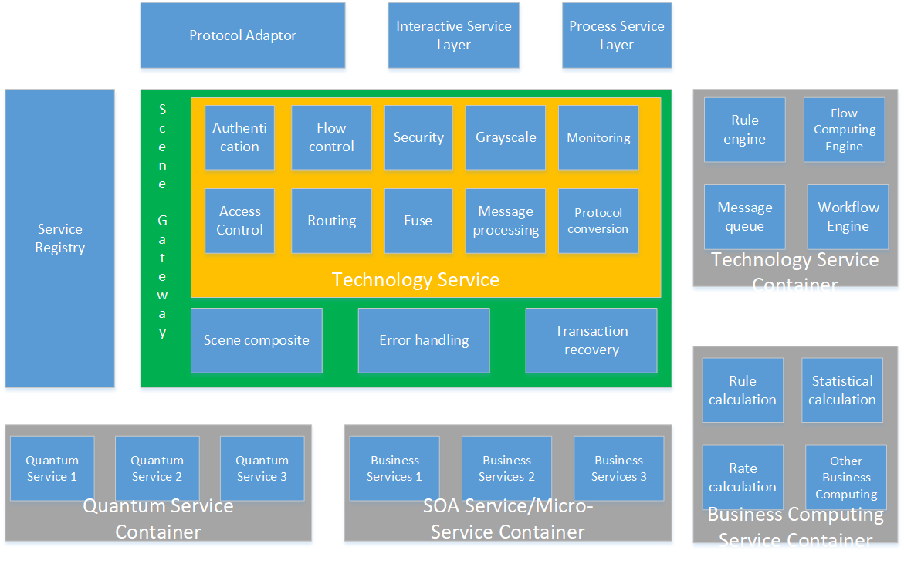
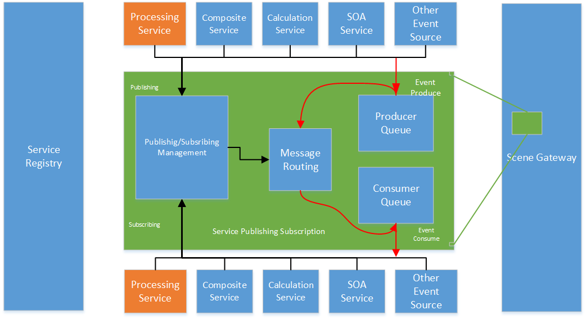

# S++Reference Logical Architecture

The basic principles of S++ layering are generally related to the granularity of the service. The smaller the granularity, the closer to the bottom layer. The higher the underlying requirements for the automation of the service, the higher the performance and reliability requirements of the service.

It is logically suggested to be divided into four layers to correspond to different granularity services.

- The quantum service layer corresponds to the smallest granularity of services, equivalent to traditional micro-services
- The scenario service layer corresponds to the composite of minimum granularity, which is equivalent to the service orchestration under the traditional micro-service architecture, and corresponds to the business service under the traditional SOA architecture.
- The process service layer corresponds to a manual business process, which is equivalent to traditional BPM.
- The interaction service layer is used to process the logic of the human-computer interaction interface, which is equivalent to the traditional WEB application.

The entire S++ recommendation is deployed through the micro-services container cloud, making it easy to use the existing tools of the micro-services architecture, as well as the rapid deployment and dynamic scaling capabilities of the container cloud.

## Quantum service layer

The quantum service layer corresponds to the micro-service layer of the micro-service architecture. The quantum service layer has the smallest granularity and can be as small as a single attribute that manipulates participants. The services of the quantum service layer will only access the data layer and will not access other services, so it can be implemented in a very simple framework. The basic content of the framework of the quantum service layer only needs to include the following:

- Data access tools (including databases and data files, etc.)
- Synchronous/asynchronous server communication component. In order to ensure higher throughput, S++ recommends that quantum services use asynchronous communication methods.
- Required management services (service registration tool, IP white-list management)
- Security component based on dynamic IP white-list
- Service code automatically generated based on the business model (including the auto-recovery code)
- Service polymorphism implementation

The simpler the quantum service framework, the more friendly the dynamic scalability of the system as a whole. When the start and stop time of the quantum service container is shortened to the order of tens of milliseconds, the response capability of the service responds to the sudden change of the load is basically close to the response capability of the preset redundant node under the cluster. Therefore, from the perspective of dynamic scaling, the granularity of the service is indeed as small as possible.

## Scene Service Layer

The service scenario layer corresponds to the traditional SOA service layer. If the business scenario composite is implemented by SOA, it is a traditional high-cohesion loosely coupled SOA service. The operation framework of the scene service layer should meet the following requirements:

- Asynchronous service publishing subscription mechanism. Since SOA services are usually bulky and have a long response time, it is recommended to use asynchronous communication to prevent system congestion.
- For the convenience of changing the technical means at any time, the framework needs to provide a pluggable technology adaptation process.
- A framework is required to meet the requirements for separation of technology and business.
- Need to implement parallel composite service engine
- Need to provide the necessary adaptation technology services

The scene service gateway can be modified by using the existing micro-service gateway, and mainly adds a scenario composite service engine, an error handling interceptor, and a composite auto-recovery module. In the S++ architecture, since zero-coupling between services is implemented in the quantum service layer, zero-coupling between services is recommended in the overall architecture, that is, any two services (whether quantum services, SOA services, or computing services) It is not recommended to call each other directly, and all calls must be completed through the process controller.

### S++ Service Call Reference Model:

- Process: Includes human machine interface processes, manual processes, and automated processes.
- Publishing: All services (except quantum services) and processes can be published. The Producer(service publisher) sends the results event of the service itself to the queue specified by the platform. The processing publisher publishes the event and context of the next compute node to Specify the queue.
- Subscriptions: All services (except quantum services) and processes can subscribe events as a event consumer, but only processes can subscribe to services, and services cannot subscribe directly to services (subscription processes only). 
- Other event sources: Other event sources can only participate as services, typically timed events and external events.
- Message persistence: It is recommended to only persist the producer queue corresponding to the manual process, because the human interface process and the automated process are time-sensitive.
- Service idempotency: All called services must be idempotent to ensure that the process can be executed again after an unexpected interruption.
- Business services can be auto-recovery: Business services, including composite services and SOA services, must provide the appropriate auto-recovery capabilities.
- Automatic publishing subscription management: S++ recommends that the system automatically identify the publishing subscription rules by analyzing the services referenced by the process, thus eliminating the large number of problems caused by manual operations.

### Scene Composition Engine

The S++ scene composition engine is used to execute a quantum service-based composite service. The execution process is completely parallel. When all the quantum service calls in the scene are returned, the engine will assemble all the returned results into service execution contracts, and will persist. The contract is returned to the caller (or a new event is generated). The following figure shows the reference implementation architecture that explains the implementation of the asynchronous quantum service composite:

## Process Service Layer

The process service layer mainly provides BPM services and automatic process services.

- By separating technology from business, BPM can process processes only for the connotation of business services.
- Through service polymorphism, BPM can eliminate business branches.
- S++ recommends using purely asynchronous process scheduling.

The following example illustrates the interaction process between pure asynchronous workflow scheduling and the whole system. One workflow F contains four service nodes of ABCD, as shown below:

The above figure assumes that the publish subscription service is implemented as a technical service in the gateway. The publisher queue is a memory queue, and the consumer queue is determined by the queue address registered by the subscriber in the service registry. The initiation of the process begins with an event E generated by a service S.

The service S invokes the gateway to generate the event E. After the technology is processed, the message E becomes an object SDO (Service Data Object) that only retains the service connotation, and the SDO enters the publisher queue.
2. The publishing/subscription service listens to the SDO, finds the in-service subscription table, finds a list of all processes that focus on the service S, and returns to the process F.
3. The publishing/subscription service invokes the gateway router and accesses process F with SDO.
4. The router obtains the protocol of the consumer queue according to the address of the process F registered by the registration center.
5. The router invokes the service technology adaptation to convert the SDO into the message format required by the process F, adds the necessary technical message, and invokes the queue protocol to send the message T to the subscriber queue.
6. Process F receives the access message T and obtains the process context associated with T (based on the implementation of the process engine, the context may be cached in different stores, or may be transmitted along with the message). Since this call is the initial call to the process, the context does not exist and the process engine determines that it is the initial call, modifying and caching the new context.
7. Flow F calls the service gateway to generate a new event Ea.
8. Ea repeats the steps 1~5, except that the service and process for subscribing to Ea in the subscription table is only service A, so the gateway will send the message to the subscriber queue of service A.
9. Service A receives the message for processing, and calls the gateway to generate event Eb after processing. Eb repeats steps 1 through 5 and sends the message to process F again.
10. Flow F repeats the action in step 6, but this time the context is not empty. After restoring the context, it is known that the next step is to call service B. After the same processing, the call is initiated to the gateway, and the process is repeated until the service D call is completed.
11. Process F completes all node calls. To end the process, the calling gateway generates event Eclose.
12. The event Eclose subscriber is the service S, so the service S receives the process end message, and the entire calling process ends.

## Interactive Service Layer

The interactive service layer mainly provides data, rendering and control logic for the front-end human-computer interaction interface, corresponding to traditional WEB applications.

The service call flow for page interaction is as follows:

1. The front end calls the rendering service in the interactive container and returns to the page.
2. The front end calls the data service and the data service calls the service gateway.
3. The SOA query service or the composite query service receives the query event request, executes the query task, and invokes the gateway to generate the query result event.
4. The data service subscribes to the query result and returns to the front page.